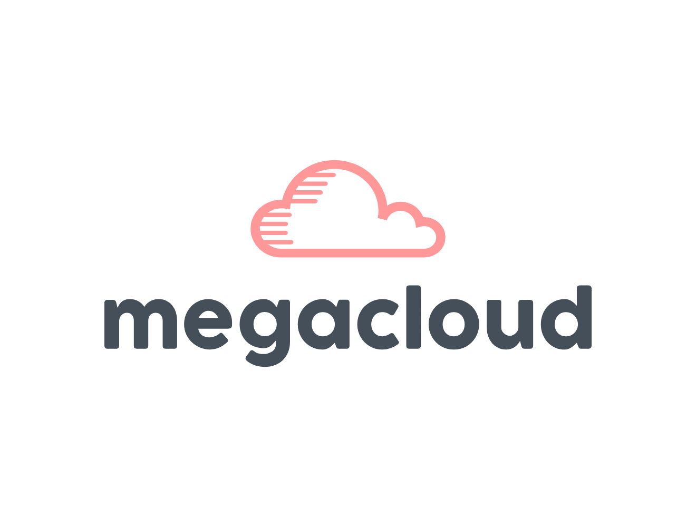

<div align="center">

# MegaCloud

<!-- Add a logo/banner here later, e.g.:  -->

**Your own unlimited cloud — built on top of the free storage you already have.**

MegaCloud links together as many free Google Drive and Dropbox accounts as you want, pools their storage into one place, and automatically splits every file you upload across all of them — so a 15GB Google account and a 2GB Dropbox account become one 17GB drive, and a 200GB account turns into a private 2TB+ pool. Ask an AI assistant questions about what's inside your files, manage everything from a web dashboard, or do it all from Telegram.

[](https://www.python.org/)
[](https://flask.palletsprojects.com/)
[](https://firebase.google.com/)
[](https://ai.google.dev/)
[](https://core.telegram.org/bots)

</div>

---

## Table of Contents

- [What this actually does](#what-this-actually-does)
- [Features](#features)
- [How a file moves through the system](#how-a-file-moves-through-the-system)
- [Tech stack](#tech-stack)
- [Project structure](#project-structure)
- [Getting started](#getting-started)
  - [1. Clone & install](#1-clone--install)
  - [2. Firebase (your database)](#2-firebase-your-database)
  - [3. Google Drive OAuth](#3-google-drive-oauth)
  - [4. Dropbox OAuth](#4-dropbox-oauth)
  - [5. Gemini API key](#5-gemini-api-key)
  - [6. Email (OTP login)](#6-email-otp-login)
  - [7. Environment variables](#7-environment-variables)
  - [8. Run it](#8-run-it)
- [Using the Telegram bot](#using-the-telegram-bot)
- [Deployment](#deployment)
- [Roadmap / known limitations](#roadmap--known-limitations)
- [License](#license)

---

## What this actually does

Free cloud storage accounts are small on their own — but most people are willing to make more than one. MegaCloud's idea is simple: instead of juggling five different apps for five different accounts, connect all of them once, and let one dashboard treat them as a single drive.

When you upload a file, MegaCloud doesn't dump it whole into one account. It looks at how much free space each of your connected accounts actually has right now, works out the proportional split, and divides the file into pieces sized to fit — sending bigger pieces to accounts with more room and smaller pieces to accounts running low. Ask for the file back, and it pulls every piece back down from wherever it landed and reassembles it transparently. You never see the pieces — you see one file.

## Features

- 🔑 **Passwordless email login** — register and sign in with a one-time code emailed to you, no password to forget. (`auth.py`, OTP-based via `Flask-Login`)
- ☁️ **Multi-account storage pooling** — connect unlimited Google Drive and Dropbox accounts via OAuth2; MegaCloud tracks live free/used space on each one.
- ✂️ **Proportional smart chunking** — files are split across whichever accounts have free space, weighted by how much each one has, with provider-specific limits respected automatically (e.g. Dropbox's chunk ceiling).
- 📁 **Full file lifecycle** — upload, categorized listing (Images / Documents / Videos / Audio / Other), search, in-browser preview, download, and delete, with chunks cleaned up across every provider they touched.
- 🤖 **AI assistant on your files** — ask questions in plain English and get answers grounded in the actual content of your documents, powered by Gemini 1.5 Flash. Extracts real text from PDF, DOCX, XLSX, CSV, and plain text files.
- 💬 **A full Telegram bot** — registration, OTP login, upload, browse by category, search, connect storage accounts, ask the AI assistant, and delete files, all without opening a browser.
- 📊 **Live dashboard** — Bootstrap-based UI showing total/used/free storage across every connected account, with per-account status and quota.

## How a file moves through the system

```
                    ┌─────────────────────────┐
                    │        Your browser /     │
                    │        Telegram client     │
                    └────────────┬─────────────┘
                                 │
                    ┌────────────▼─────────────┐
                    │      Flask web app         │
                    │   (app.py + Flask-Login)    │
                    └──┬───────────┬───────────┬─┘
                       │           │           │
            ┌──────────▼──┐ ┌──────▼─────┐ ┌───▼────────────┐
            │  FileManager  │ │  AIAgent   │ │  AuthManager    │
            │ (chunk, send, │ │ (extract,  │ │ (OTP generate   │
            │  reassemble)  │ │  ask Gemini)│ │  + email send)  │
            └──────┬───────┘ └─────┬──────┘ └─────────────────┘
                   │               │
       ┌───────────┼───────────┐   │
       │           │           │   │
┌──────▼───┐ ┌─────▼────┐ ┌────▼───▼──┐
│  Google   │ │ Dropbox   │ │ Firestore  │
│  Drive    │ │           │ │ (users,    │
│ account 1 │ │ account 1 │ │  files,    │
│  ...N     │ │  ...N     │ │  file text)│
└───────────┘ └───────────┘ └────────────┘
```

1. **Upload** — the file is saved temporarily, text is extracted for the AI index, then `FileManager` checks free space across every active provider and works out how big each piece should be.
2. **Distribute** — each piece is uploaded to its assigned account inside a dedicated `MegaCloud/<your-email>` folder, and the resulting provider file IDs are recorded in order.
3. **Reassemble** — on download or preview, every piece is pulled back from wherever it landed (by provider + account), put back in order, and streamed to you as one file.
4. **Ask** — the AI assistant searches extracted text across your files for relevant matches, then hands that context to Gemini to answer your question.

## Tech stack

| Layer | Choice |
|---|---|
| Web framework | Flask 2.3, Flask-Login, Flask-Session, Flask-WTF (CSRF) |
| Database | Google Firestore (NoSQL — `users`, `files`, `file_contents` collections) |
| Storage backends | Google Drive API v3, Dropbox API v2 |
| AI | Google Gemini 1.5 Flash (`google-generativeai`) |
| Text extraction | PyPDF2 (PDF), python-docx (Word), openpyxl (Excel), plain read (text/CSV) |
| Bot | python-telegram-bot, running as a separate worker process |
| Frontend | Bootstrap 5, Font Awesome, vanilla JS (`static/script.js`) |
| Email | SMTP (OTP delivery) |
| Resilience | `tenacity` retries with exponential backoff on every external API call |

## Project structure

```
MegaCloud/
├── app.py                      # Flask routes: auth, upload/download, storage accounts, AI
├── auth.py                     # OTP generation + email sending
├── models.py                   # User & File models, Firestore persistence
├── file_manager.py             # Chunking, distribution, reassembly across providers
├── ai_agent.py                 # Text extraction, content search, Gemini Q&A
├── bot.py                      # Telegram bot mirroring the web app's features
├── storage_providers/
│   ├── base_provider.py        # Common interface (upload/download/delete)
│   ├── google_drive.py         # Google Drive implementation
│   ├── dropbox.py              # Dropbox implementation
│   └── mega.py                 # Mega.nz — placeholder, not yet implemented
├── templates/                  # login, register, OTP verification, dashboard
├── static/                     # styles.css, script.js, logo
├── requirements.txt
├── Procfile                    # web: gunicorn app:app / worker: bot process
└── runtime.txt                 # Python 3.11.5
```

## Getting started

### 1. Clone & install

```bash
git clone <your-repo-url> megacloud
cd megacloud
python -m venv venv
source venv/bin/activate        # Windows: venv\Scripts\activate
pip install -r requirements.txt
```

### 2. Firebase (your database)

1. Go to the [Firebase Console](https://console.firebase.google.com/) → create a project.
2. Build → Firestore Database → Create database (start in test mode for local development).
3. Project settings → Service accounts → **Generate new private key** — this downloads a JSON file.
4. You'll paste the *entire contents* of that JSON file into `FIREBASE_CREDENTIALS` in your `.env` (see step 7) as a single-line string.

### 3. Google Drive OAuth

1. [Google Cloud Console](https://console.cloud.google.com/) → new project → enable **Google Drive API**.
2. APIs & Services → OAuth consent screen → External → add yourself (and anyone testing) as a **test user**.
3. Credentials → Create OAuth client ID → Web application → add redirect URI:
   ```
   http://localhost:5000/oauth/google/callback
   ```
4. Copy the Client ID and Client Secret into `.env`.

### 4. Dropbox OAuth

1. [Dropbox App Console](https://www.dropbox.com/developers/apps) → Create app → Scoped access → Full Dropbox (or App folder, if you'd rather keep it sandboxed).
2. Under **Permissions**, enable `files.content.write`, `files.content.read`, and `account_info.read`.
3. Under **Settings**, add a redirect URI:
   ```
   http://localhost:5000/oauth/dropbox/callback
   ```
4. Copy the App key and App secret into `.env`.

### 5. Gemini API key

Get a free key at [Google AI Studio](https://aistudio.google.com/app/apikey) → paste into `GOOGLE_API_KEY` in `.env`.

### 6. Email (OTP login)

Any SMTP account works. For Gmail: turn on 2-Step Verification, then generate an [App Password](https://myaccount.google.com/apppasswords) — use that, not your normal password.

### 7. Environment variables

Create a `.env` file in the project root:

```ini
# Flask
FLASK_SECRET_KEY=replace-with-a-long-random-string
FLASK_ENV=development
PORT=5000

# Firebase — paste the full service-account JSON as one line
FIREBASE_CREDENTIALS={"type": "service_account", ...}

# Google Drive OAuth
GOOGLE_CLIENT_ID=
GOOGLE_CLIENT_SECRET=
GOOGLE_REDIRECT_URI=http://localhost:5000/oauth/google/callback

# Gemini (AI assistant) — separate from the OAuth client above
GOOGLE_API_KEY=

# Dropbox OAuth
DROPBOX_APP_KEY=
DROPBOX_APP_SECRET=
DROPBOX_REDIRECT_URI=http://localhost:5000/oauth/dropbox/callback

# Email OTP delivery
SMTP_SERVER=smtp.gmail.com
SMTP_PORT=587
SMTP_EMAIL=
SMTP_PASSWORD=
SMTP_SENDER_NAME=MegaCloud
OTP_LENGTH=4

# Telegram bot (only needed if you're running bot.py)
TELEGRAM_BOT_TOKEN=
FLASK_APP_URL=http://localhost:5000
```

### 8. Run it

```bash
flask --app app run
# or
python app.py
```

Open **http://localhost:5000**, register with an email, enter the OTP that arrives, and you're in. Add a storage account from the dashboard before uploading anything — MegaCloud needs at least one connected, authorized account to send pieces to.

## Using the Telegram bot

The bot (`bot.py`) mirrors the web app — registration, login, upload, browsing by category, search, connecting storage accounts, AI questions, and deletion, all through chat.

```bash
python bot.py
```

> **Before running this:** `python-telegram-bot`, `aiohttp`, `Pillow`, and `cachetools` are imported by `bot.py` but aren't currently listed in `requirements.txt` — install them separately:
> ```bash
> pip install python-telegram-bot aiohttp Pillow cachetools
> ```

Message your bot `/start` on Telegram to begin.

## Deployment

The included `Procfile` is written for a Heroku-style platform:

```
web: gunicorn app:app
worker: python telebot.py
```

A couple of things to square away before deploying:
- `gunicorn` isn't in `requirements.txt` yet — add it (`pip install gunicorn` then freeze it in).
- The worker line references `telebot.py`; the actual bot entrypoint in this repo is `bot.py` — update the `Procfile` to match, or rename the file, before relying on the worker process.
- Firestore, Google, Dropbox, and Gemini credentials all need to be set as environment variables on whatever platform you deploy to — none of them are read from local files at runtime except the Firebase JSON, which is read from the `FIREBASE_CREDENTIALS` env var directly.

## Roadmap / known limitations

Being upfront about where this stands today:

- **No encryption layer yet** — file pieces are uploaded to Google Drive/Dropbox as-is. Anyone with access to one of your connected accounts could open MegaCloud's `MegaCloud/<email>` folder directly. Encrypting each piece before it leaves the server (e.g. AES-256) is the natural next step.
- **No redundancy** — a file's pieces are spread across accounts for *capacity*, not *fault tolerance*. If one connected account is disconnected or loses access, files with a piece on it can't be reassembled. There's no backup/parity piece (yet).
- **Mega.nz support is a placeholder** — `storage_providers/mega.py` exists but every method raises `NotImplementedError`. Only Google Drive and Dropbox are actually wired up.
- **AI search is keyword + fuzzy matching, not embeddings** — `chromadb` and `sentence-transformers` are in `requirements.txt` but aren't actually used anywhere in the code yet; `ai_agent.py` currently ranks matches with word-overlap scoring and `difflib.SequenceMatcher`. Swapping in real vector search is a clear upgrade path, and the dependencies are already there waiting for it.
- **bot.py's dependencies aren't in requirements.txt** — see [Using the Telegram bot](#using-the-telegram-bot) above.
- **No automated tests** — manual testing only, currently.

None of this is a knock on what's built — passwordless OTP auth, real multi-provider OAuth, proportional chunked distribution, and a working AI assistant grounded in actual file content is a lot of real, working surface area. These are just the honest "here's what's next" items.

## License

No license file is currently included in this repository. If you intend for others to use or contribute to this project, consider adding one — [MIT](https://choosealicense.com/licenses/mit/) is a common, permissive default for portfolio projects like this one.

